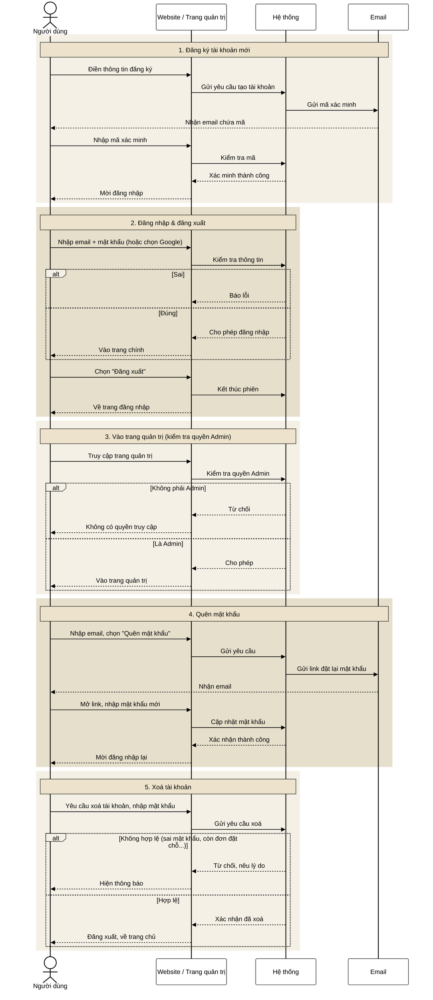

# Luồng đăng nhập / tài khoản — bản gộp 1 diagram

Gộp từ [auth-flow-simple.md](./auth-flow-simple.md) thành một sơ đồ duy nhất, mỗi phần tô màu riêng để dễ phân biệt. Bản kỹ thuật chi tiết xem [auth-flow-sequence-diagrams.md](./auth-flow-sequence-diagrams.md).

App mobile hiện chưa kết nối hệ thống thật, đang dùng dữ liệu giả để demo giao diện.

