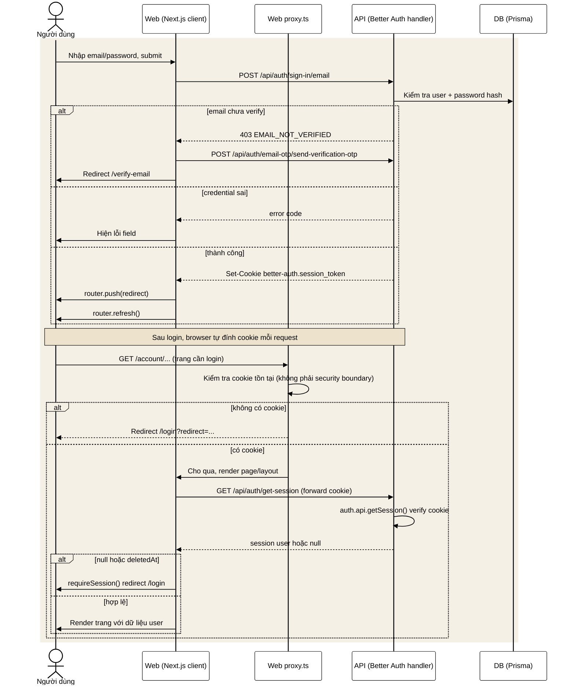
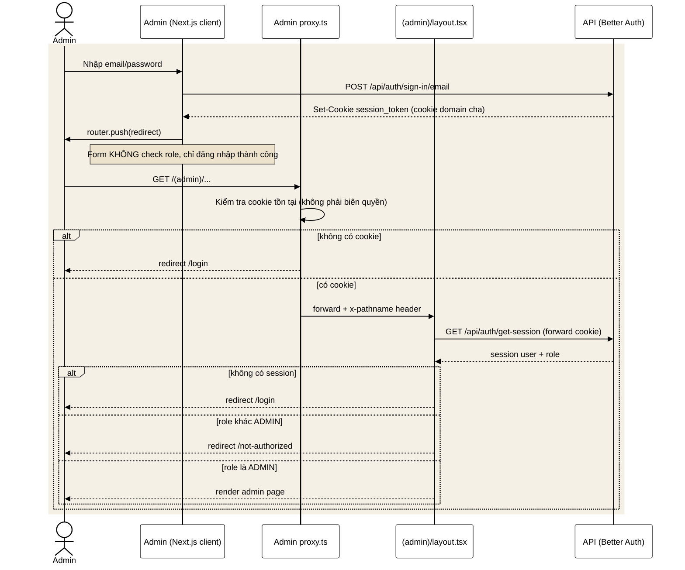
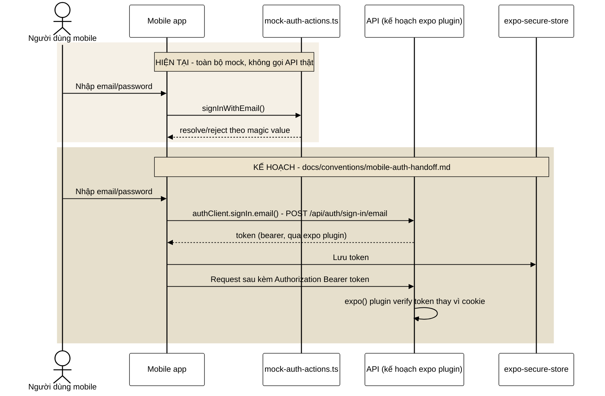
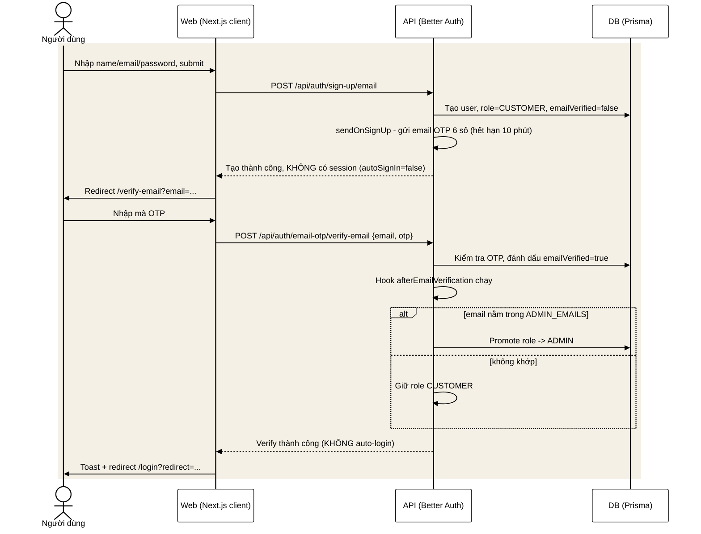
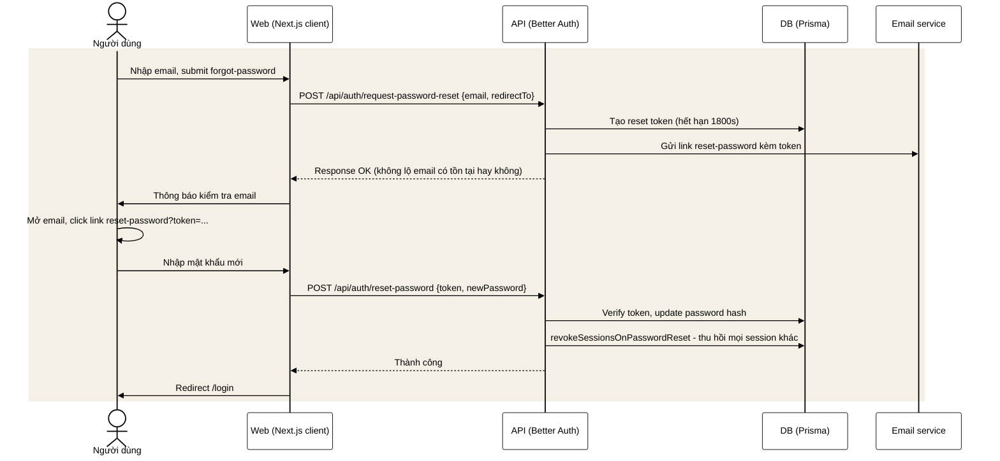
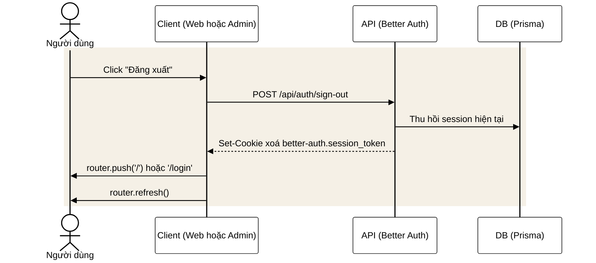
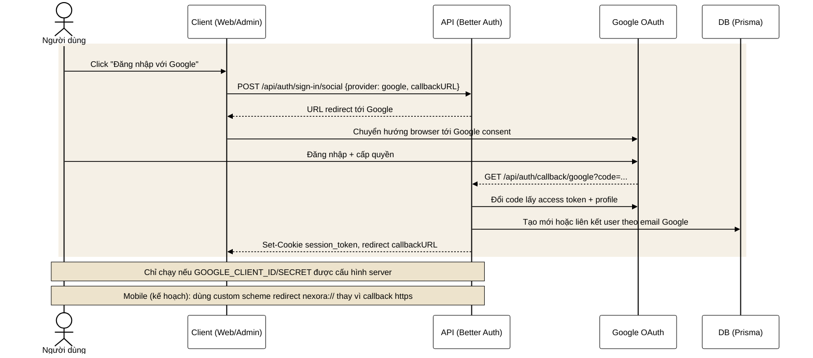
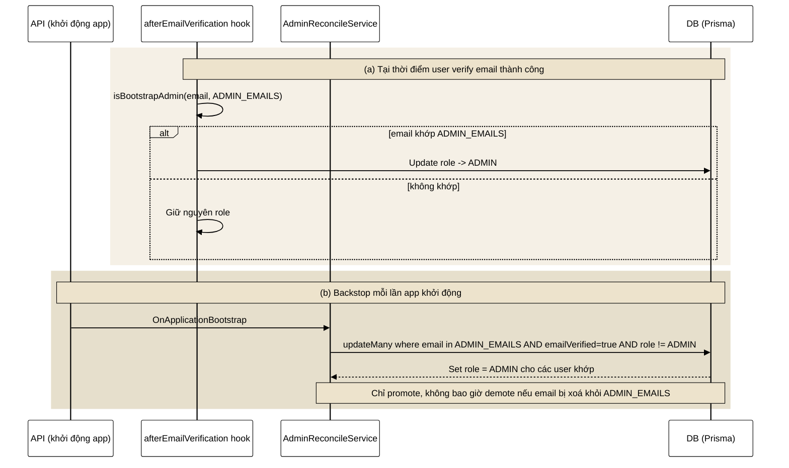
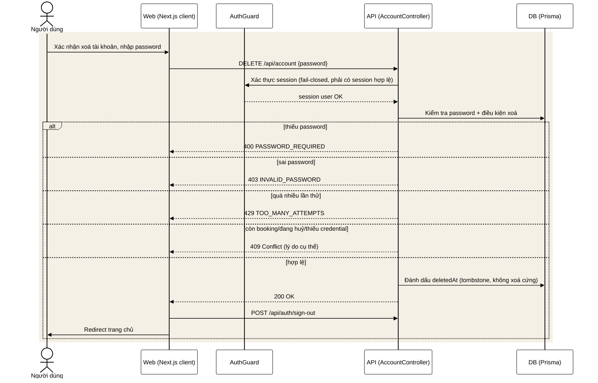

# Auth flow — phân tích & sequence diagrams

Lib dùng: **better-auth 1.6.23** (`apps/api`, `apps/web`, `apps/admin`). Session kiểu cookie httpOnly (`better-auth.session_token`), không JWT/bearer cho web/admin, không có endpoint refresh riêng — cookie tự gia hạn qua `updateAge` của better-auth. Mobile (`apps/mobile`) **chưa nối API thật**, hiện chỉ có mock UI theo `docs/conventions/mobile-auth-handoff.md`.

## Tổng quan nguồn

- `apps/api/src/auth/auth.config.ts` — cấu hình `betterAuth()`: email/password, email OTP verification, social Google, hooks, cookie cross-subdomain.
- `apps/api/src/auth/auth.controller.ts` — mount toàn bộ route better-auth tại `ALL /api/auth/*`.
- `apps/api/src/auth/auth.guard.ts` — guard toàn cục, fail-closed, verify session qua `auth.api.getSession()`, check role qua `@Roles()`.
- `apps/api/src/auth/admin-bootstrap.ts` + `admin-reconcile.ts` — promote role ADMIN theo `ADMIN_EMAILS`.
- `apps/api/src/auth/account.controller.ts` — self-service account (me, xoá tài khoản).
- `apps/web/src/lib/auth-client.ts`, `apps/web/src/components/auth/*` — client web (login, register, verify OTP, forgot/reset password, sign-out).
- `apps/admin/src/lib/auth-client.ts`, `apps/admin/src/components/auth/*`, `apps/admin/src/app/(admin)/layout.tsx`, `apps/admin/src/lib/admin-gate.ts` — client admin, role gate.
- `apps/mobile/src/features/auth/mock-auth-actions.ts`, `docs/conventions/mobile-auth-handoff.md` — mobile hiện mock, kế hoạch dùng plugin `expo()` của better-auth.

---

## 1. Web — login + truy cập trang bảo vệ

## 2. Admin — login + role gate

## 3. Mobile — hiện trạng (mock) vs kế hoạch thật

## 4. Đăng ký + xác minh email OTP (web)

## 5. Quên mật khẩu / đặt lại mật khẩu (web)

## 6. Đăng xuất (web + admin)

## 7. Đăng nhập Google OAuth

## 8. Bootstrap / promote role ADMIN

## 9. Xoá tài khoản (self-service)

---

## Điều chưa xác nhận từ source

- Path chính xác từng route nội bộ better-auth suy ra từ client call (`authClient.signIn.email` ...), chưa mở `node_modules/better-auth/dist` để verify từng chữ.
- Mobile: cơ chế lưu token, tên header, refresh — chưa có trong source, chỉ có trong `docs/conventions/mobile-auth-handoff.md` (kế hoạch, chưa build).
- `account.service.ts` — chỉ đọc phần map lỗi ở controller, chưa đọc hết logic service (đếm số lần thử sai password, rule xoá).
- Giá trị `updateAge`/`expiresIn` cookie dùng default của better-auth, không override rõ trong `auth.config.ts`.
